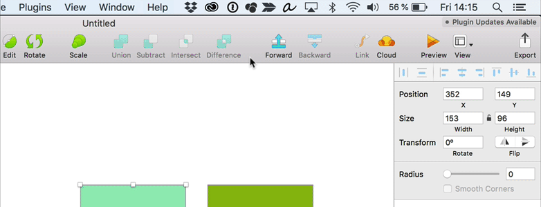

# ms-colors

A little menu bar helper für macOS to easily access the mySugr brand and UI colors. ms-colors is a fork of [Materialette](https://github.com/mike-schultz/materialette/) by Mark Schultz.

## How to use

### Pick a color

Click on the icon in the menu bar and then on a color to copy its value to the clipboard.

### Check if a color is in the mySugr palette

 Paste a color code with CMD+V while the ms-colors window is open and it will tell you the name of the color. This works with hex codes (#8eb927) as well as tab-separated RGB codes (135 175 36). The latter is handy when you use macOS's [Digital Color Meter](https://en.wikipedia.org/wiki/DigitalColor_Meter).

## Install

1. Download the latest release from the [Releases](https://github.com/bildlich/materialette/releases) page
2. Unzip the file
3. Move the ms-colors.app file to the `/Applications` directory
4. Right-click and choose "Open" (double-click may not work because macOS finds Non-App-Store-apps suspicious)

## Develop
* Install dependencies: `$ npm install`
* Compile SCSS -> CSS `$ gulp sass` or `$ gulp sass:watch`
* Start the application with `$ npm start `
* Build the application with  `$ npm run build`
